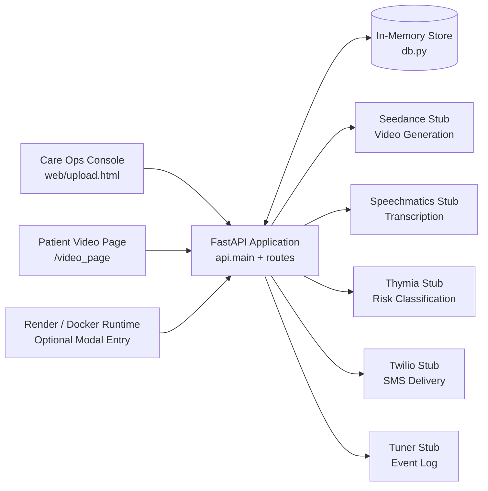
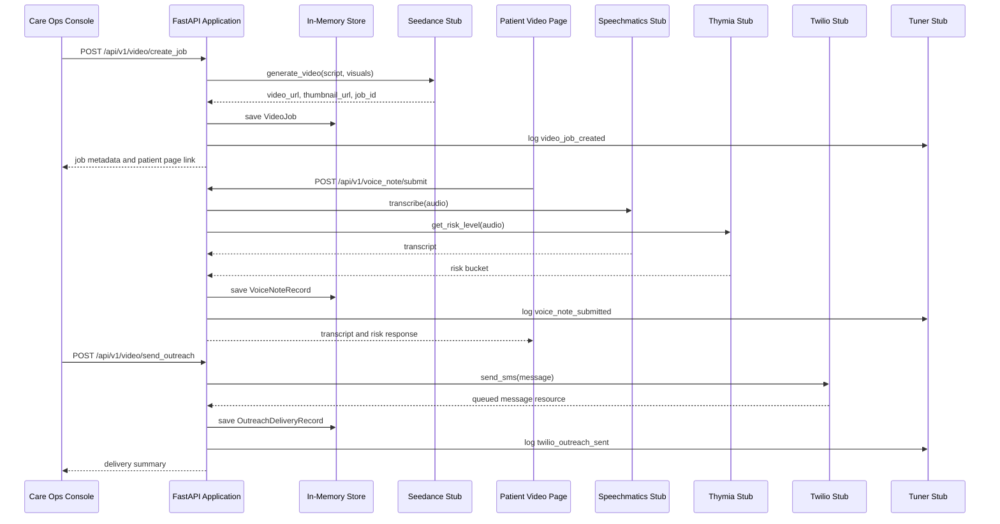

# System Architecture: Signal Over Noise

## Overview

Signal Over Noise is a demo-first care outreach platform that combines personalised video messaging, voice note capture, lightweight risk classification, and outreach follow-up tooling in a single web application. The current implementation is a monolithic FastAPI service that serves both a browser-based care operations console and public-facing patient video pages, with workflow state held in memory for simplicity and speed of iteration.

The system is designed to demonstrate an end-to-end patient engagement journey: generate a campaign-specific video, share a patient page, capture a voice response, derive a coarse risk signal, and support SMS follow-up, fallback links, and case review actions. The architecture favours clarity and low deployment overhead over horizontal scalability, which makes it suitable for demos, prototypes, hackathons, and product validation rather than production healthcare workloads.

## Key Requirements

- Support a complete outreach journey from video generation to follow-up review.
- Provide a browser-based care operations dashboard for creating and monitoring demo cases.
- Serve public patient pages that play campaign videos and accept recorded or mock voice notes.
- Expose a small REST API for video jobs, voice notes, outreach delivery, fallback links, and review workflows.
- Integrate with external provider concepts for video generation, transcription, risk assessment, event logging, and SMS delivery.
- Keep local setup simple with minimal infrastructure dependencies.
- Return responses quickly for interactive demo use.
- Remain easy to deploy as a single container or managed Python web service.
- Preserve enough observability to explain system behaviour during demos.
- Avoid storing secrets in code and keep environment-based configuration available for provider credentials.

## High-Level Architecture

Signal Over Noise is implemented as a single deployable backend that exposes REST endpoints under `/api/v1`, mounts static assets under `/web`, and serves public patient pages at `/video_page`. The browser clients communicate directly with the FastAPI application using `fetch`, while the backend coordinates in-memory domain state and calls stubbed provider adapters that represent Seedance, Speechmatics, Thymia, Tuner, and Twilio.

The architecture intentionally keeps all business capabilities inside one process: API routing, HTML rendering, workflow orchestration, demo seeding, automation-run tracking, and event capture. This reduces operational complexity, but it also means persistence, concurrency control, and fault isolation are limited by the boundaries of a single application instance.

This diagram shows the current container-level design. Two browser clients talk to a single FastAPI application, which owns workflow orchestration and state management, while external capabilities are represented through provider adapter modules rather than separate deployable services.

## Component Details

### Web Client

#### Care Operations Console

- Responsibilities: create and preview outreach jobs, upload avatar and background assets, seed demo data, reset the demo environment, inspect dashboard state, and trigger review or Twilio simulation actions.
- Main technologies: static HTML, CSS, and vanilla JavaScript in [`web/upload.html`](/Users/darkcomet/Documents/Hackathon/Signal Over Noise/web/upload.html:1).
- Important data it owns: browser-local presentation state, reviewer drafts stored in `localStorage`, and temporary form state for campaign presets, media upload, and dashboard filters.
- Communication: calls JSON and multipart REST endpoints under `/api/v1/...` using `fetch`.

#### Patient Video Page

- Responsibilities: render a personalised campaign video page, play the generated video, capture microphone input, submit voice notes, and surface the latest signal, review state, delivery history, and fallback information.
- Main technologies: HTML template in [`web/index.html`](/Users/darkcomet/Documents/Hackathon/Signal Over Noise/web/index.html:1), client-side logic in [`web/js/record.js`](/Users/darkcomet/Documents/Hackathon/Signal Over Noise/web/js/record.js:1), and browser `MediaRecorder` and `getUserMedia` APIs.
- Important data it owns: recorded audio chunks in browser memory and per-session UI state for the active patient journey.
- Communication: uses form-data uploads for voice note submission and JSON API calls for history, review, Twilio, and fallback views.

### Application Backend

#### FastAPI Application

- Responsibilities: boot the application, seed demo video jobs on startup, serve the REST API and static assets, render public patient video pages, and coordinate video creation, voice note ingestion, risk handling, review, and outreach workflows.
- Main technologies: FastAPI, Uvicorn, Pydantic, Jinja2, and `python-dotenv`, with the entry point in [`api/main.py`](/Users/darkcomet/Documents/Hackathon/Signal Over Noise/api/main.py:1).
- Important data it owns: request validation models, routing logic, orchestration logic, and lifecycle hooks for startup seeding.
- Communication: receives HTTP requests from both browser clients, calls the in-memory repository layer directly, and invokes provider adapter modules as in-process library calls.

#### Video and Workflow Routes

- Responsibilities: manage video job creation, script previews, demo job retrieval, dashboard overviews, care queue state, outreach delivery, fallback handoffs, Twilio status updates, and case review actions.
- Main technologies: FastAPI route handlers and Pydantic models in [`api/routes/video.py`](/Users/darkcomet/Documents/Hackathon/Signal Over Noise/api/routes/video.py:1).
- Important data it owns: campaign templates, demo scenarios, and derived dashboard and sponsor summary views.
- Communication: reads and writes `video_jobs`, `outreach_deliveries`, `fallback_handoffs`, `case_reviews`, and event logs.

#### Voice Note Routes

- Responsibilities: accept uploaded audio files, generate demo voice notes, trigger transcription and risk classification, persist voice note records, and produce summary views.
- Main technologies: FastAPI route handlers in [`api/routes/voice_note.py`](/Users/darkcomet/Documents/Hackathon/Signal Over Noise/api/routes/voice_note.py:1).
- Important data it owns: voice note submission responses, demo risk profiles, and transcription configuration.
- Communication: writes temporary audio files to `/tmp`, calls Speechmatics and Thymia provider adapters, and emits observability events through the Tuner adapter.

#### Media Routes

- Responsibilities: accept avatar and background image uploads for campaigns and persist uploaded assets into the static web directory.
- Main technologies: FastAPI multipart handling in [`api/routes/media.py`](/Users/darkcomet/Documents/Hackathon/Signal Over Noise/api/routes/media.py:1).
- Important data it owns: campaign-specific media file paths.
- Communication: writes files to `web/media/avatars` and `web/media/backgrounds` and returns relative URLs for later use in video job creation.

#### Automation Routes

- Responsibilities: expose batch outreach capabilities, execute local or Modal-eligible automation runs, and return tracked run status or recent run lists for replayable demo operations.
- Main technologies: FastAPI route handlers and Pydantic models in [`api/routes/automation.py`](/Users/darkcomet/Documents/Hackathon/Signal Over Noise/api/routes/automation.py:1).
- Important data it owns: automation run request and response models, execution-mode capability reporting, and run-status readback contracts.
- Communication: invokes the automation service layer, reads and writes `automation_runs` in the shared store, and validates whether Modal execution is configured in the current environment.

#### Automation Service

- Responsibilities: orchestrate multi-recipient batch outreach runs, create per-recipient video jobs, optionally send SMS outreach, accumulate run results, and derive run completion state.
- Main technologies: in-process Python service in [`api/services/automation.py`](/Users/darkcomet/Documents/Hackathon/Signal Over Noise/api/services/automation.py:1).
- Important data it owns: `BatchOutreachRecipientSpec` inputs and run result accumulation logic.
- Communication: calls internal video-job and outreach workflow helpers directly and persists `AutomationRunRecord` state into the shared in-memory repository.

### Data Store

#### In-Memory Repository

- Responsibilities: hold all domain records for the running process and provide a simple shared store for demo workflows.
- Main technologies: Python dataclasses and module-level dictionaries in [`db.py`](/Users/darkcomet/Documents/Hackathon/Signal Over Noise/db.py:1).
- Important data it owns: `VideoJob`, `VoiceNoteRecord`, `OutreachDeliveryRecord`, `FallbackHandoffRecord`, `CaseReviewRecord`, and `AutomationRunRecord`.
- Communication: accessed directly by route handlers through `get_db()`.

### External Integrations

#### Seedance Adapter

- Responsibilities: represent video generation for a personalised script and visual inputs.
- Main technologies: in-process stub in [`api/services/seedance.py`](/Users/darkcomet/Documents/Hackathon/Signal Over Noise/api/services/seedance.py:1).
- Important data it owns: generated video and thumbnail URLs.
- Communication: called synchronously from the video workflow.

#### Speechmatics Adapter

- Responsibilities: represent speech-to-text transcription for uploaded or mock audio.
- Main technologies: in-process stub in [`api/services/speechmatics.py`](/Users/darkcomet/Documents/Hackathon/Signal Over Noise/api/services/speechmatics.py:1).
- Important data it owns: transcript text and voice configuration metadata.
- Communication: called from voice note ingestion before persistence.

#### Thymia Adapter

- Responsibilities: represent risk classification from the submitted audio artefact.
- Main technologies: in-process stub in [`api/services/thymia.py`](/Users/darkcomet/Documents/Hackathon/Signal Over Noise/api/services/thymia.py:1).
- Important data it owns: `low`, `medium`, or `high` risk bucket outputs.
- Communication: called from voice note ingestion.

#### Tuner Adapter

- Responsibilities: capture structured event logs for demo observability.
- Main technologies: in-process logging stub in [`api/services/tuner.py`](/Users/darkcomet/Documents/Hackathon/Signal Over Noise/api/services/tuner.py:1).
- Important data it owns: `EVENT_LOGS`, an append-only in-memory event list for the current process lifetime.
- Communication: called after major workflow actions such as job creation, voice note submission, outreach delivery, retry, fallback, and review.

#### Twilio Adapter

- Responsibilities: represent SMS delivery and callback payload generation, and support delivery status simulation for demos.
- Main technologies: in-process stub in [`api/services/twilio.py`](/Users/darkcomet/Documents/Hackathon/Signal Over Noise/api/services/twilio.py:1).
- Important data it owns: synthetic Twilio message SIDs and message resource metadata.
- Communication: called during outreach delivery and status update flows.

#### Modal Deployment Entry

- Responsibilities: provide an optional ASGI deployment entrypoint for serving the same FastAPI application through Modal.
- Main technologies: optional Modal configuration in [`modal_app.py`](/Users/darkcomet/Documents/Hackathon/Signal Over Noise/modal_app.py:1).
- Important data it owns: deployment metadata such as the Modal app name, image definition, concurrency allowance, and timeout.
- Communication: imports `api.main:app` and exposes it as an ASGI application when the `modal` package is installed.

## Data Flow

### Typical User and System Flows

1. A care operations user creates or seeds a video job from the demo console.
2. The backend composes campaign-specific script text, calls the Seedance adapter, and stores the resulting video job in memory.
3. The user opens or shares the generated patient page.
4. The patient page records or simulates a voice note and submits it to the backend.
5. The backend writes the temporary audio file, calls transcription and risk adapters, stores the voice note, and logs an observability event.
6. The care team reviews queue state, sends SMS outreach, simulates delivery outcomes, prepares fallback links if needed, and records case review actions.
7. For batch demos, the care team can trigger an automation run that creates jobs and optionally outreach deliveries for multiple recipients in one tracked operation.

This sequence diagram highlights the main orchestration responsibilities of the backend. The application coordinates browser requests, external provider calls, and in-memory state changes, which keeps the interaction model straightforward but makes application state tightly coupled to a single process.

## Data Model

The current data model is intentionally lightweight and held in memory rather than a relational schema.

- `VideoJob`: represents a generated outreach video for a given customer and campaign, and stores script text, media URLs, plan metadata, and creation time.
- `VoiceNoteRecord`: represents a submitted or seeded patient voice response, and stores transcript text, risk bucket, campaign, customer, and timestamp.
- `OutreachDeliveryRecord`: represents an SMS delivery attempt, and stores destination, provider metadata, status, message body, and callback details.
- `FallbackHandoffRecord`: represents a fallback page link prepared after a delivery issue or manual control action, and stores the related patient journey, original message SID, delivery status, and page URL.
- `CaseReviewRecord`: represents a care-team review action for a case, and stores reviewer, outcome, note, source, and review timestamp. The latest active review for a customer and campaign pair is the one used to derive queue state and dashboard review summaries.
- `AutomationRunRecord`: represents a batch outreach execution, and stores execution mode, processed recipient counts, error counts, per-recipient results, and completion timestamps.

High-level relationships:

- One customer and campaign pair can have many `VideoJob` records over time.
- One customer and campaign pair can have many `VoiceNoteRecord` entries.
- One customer and campaign pair can have many `OutreachDeliveryRecord` and `FallbackHandoffRecord` entries.
- One customer and campaign pair can have many `CaseReviewRecord` entries, with the latest review used to derive active workflow state.
- One automation request creates one `AutomationRunRecord`, which in turn references many recipient-level result entries and may create many `VideoJob` and `OutreachDeliveryRecord` records.

For demo operations, the reset flow clears all in-memory workflow tables, including `AutomationRunRecord` entries, before reseeding the default demo video journeys.

## Infrastructure & Deployment

The system is packaged as a single Python container and can also be deployed directly as a managed Python web service.

- Container deployment: defined in [`Dockerfile`](/Users/darkcomet/Documents/Hackathon/Signal Over Noise/Dockerfile:1), uses `python:3.11-slim`, and runs `uvicorn api.main:app --host 0.0.0.0 --port 10000`.
- Managed deployment: defined in [`render.yaml`](/Users/darkcomet/Documents/Hackathon/Signal Over Noise/render.yaml:1), exposes `/healthz` for health checks, installs dependencies from `requirements.txt`, and runs the same Uvicorn entry point.
- Optional serverless deployment: defined in [`modal_app.py`](/Users/darkcomet/Documents/Hackathon/Signal Over Noise/modal_app.py:1), exposes the FastAPI app as an ASGI function when the `modal` dependency is installed separately.

Suggested environments:

- Development: local Uvicorn process with `.env` configuration, suitable for UI iteration and demo workflow testing.
- Staging: not currently defined in the repository; if a preview environment is introduced later, it should be used for validating provider credentials, public URLs, and hosted media behaviour before production-style demos.
- Production: currently represented by the Render deployment model; in the present design, production should be treated as demo-grade because state is process-local and non-persistent.

## Scalability & Reliability

The present architecture supports small-scale interactive use but has clear constraints.

- Current strengths: very low operational complexity, fast local startup, short request paths, and no dependency on external databases or queues for core demos.
- Current limitations: the in-memory store is lost on restart or redeploy, horizontal scaling is unsafe because each instance would hold different state, there is no background job system for slow or retriable work, provider calls are synchronous from the application process, automation runs execute in-process, and file uploads are written to local disk that is not shared across replicas.
- Reliability behaviour: health is exposed via `/healthz`, demo reset and seeding flows provide a quick recovery path for corrupted demo state, and failures in stub providers remain isolated to the triggering request, but no retry queue exists.

## Security & Compliance

The repository includes healthcare-style workflows, so security and privacy boundaries should be made explicit even though the current implementation is a demo.

- Current measures: secrets are loaded from environment variables via `.env`, external provider credentials are not hard-coded, public patient access is scoped by `customer_id` and `campaign_type` query parameters, and uploaded files are written to controlled application paths.
- Current gaps: there is no authentication or authorisation layer, public patient pages are not protected by signed tokens or expiring links, data is stored in plaintext process memory and local files, there is no audit-grade access logging, rate limiting, or anti-abuse control, and there is no encryption-at-rest strategy because there is no persistent datastore.
- Compliance considerations: real patient or regulated healthcare data should not be placed in this system without major redesign. A production-ready version would need signed access links, role-based access control, proper consent handling, encrypted persistence, secret rotation, retention policies, and region-aware data processing.

## Observability

Observability is implemented as lightweight, demo-oriented application logging and in-memory event capture.

- Logging: the Tuner adapter appends structured events to `EVENT_LOGS`, and the backend exposes an observability feed at `/api/v1/video/observability`.
- Metrics: dashboard summary endpoints derive counts for video jobs, voice notes, reviews, and outreach activity; these are useful for demos, but they are not emitted to an external metrics backend.
- Tracing: distributed tracing is not implemented.
- Health: `/healthz` provides a simple readiness signal.

## Trade-offs & Decisions

### Design Decisions

- Single-process monolith: chosen to minimise setup time and reduce coordination overhead between services; trade-off: limited scalability, resilience, and service isolation.
- In-memory persistence: chosen to keep the demo self-contained and remove the need for database provisioning; trade-off: no durability, no replica consistency, and no audit trail.
- Static HTML and vanilla JavaScript: chosen for speed of delivery and simple deployment; trade-off: lower component reuse and weaker structure as the UI grows.
- Provider stubs instead of live integrations: chosen to simulate realistic workflows without depending on third-party availability during demos; trade-off: behaviour differs from production-grade providers and may mask integration complexity.
- Public query-parameter page routing: chosen for easy sharing during demonstrations; trade-off: inadequate access control for real-world sensitive content.
- Optional Modal scaffolding without a required runtime dependency: chosen to keep local setup light while still showing a path toward serverless execution; trade-off: deployment capability differs between environments unless Modal is installed and configured.

## Future Improvements

- Replace the in-memory repository with PostgreSQL for durable workflow state.
- Move media assets to object storage such as S3 or an equivalent managed bucket.
- Add Redis or a queueing system for asynchronous transcription, video generation, and SMS retry workflows.
- Introduce signed patient links, operator authentication, and role-based authorisation.
- Split provider adapters behind service interfaces and add resilient retry and timeout policies.
- Add OpenTelemetry-based tracing and external log and metrics export.
- Formalise environment promotion with separate development, staging, and production deployments.
- Add automated schema migrations, retention controls, and audit logging.
- Replace stub provider logic with production integrations once security and persistence are in place.
