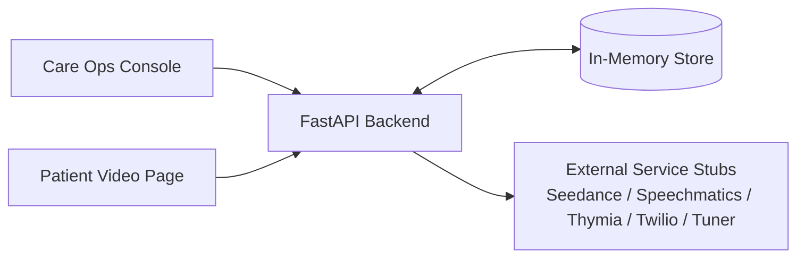

# Signal Over Noise

*Demo-first care outreach for personalised video check-ins and voice-note triage.*

[](#tests)
[](#tests)
[](#installation)
[](#license)

## Description

Signal Over Noise is a FastAPI-based demo application for care teams, who need to show a complete outreach workflow in one place. It solves the problem of stitching together personalised video outreach, patient voice-note capture, lightweight risk signalling, and follow-up actions by packaging the full flow into a single deployable web app with a browser-based care operations console and public patient pages.

## Table of Contents

- [Features](#features)
- [Tech Stack](#tech-stack)
- [Architecture Overview](#architecture-overview)
- [Installation](#installation)
- [Usage](#usage)
- [Configuration](#configuration)
- [Screenshots / Demo](#screenshots--demo)
- [API / CLI Reference](#api--cli-reference)
- [Tests](#tests)
- [Roadmap](#roadmap)
- [Contributing](#contributing)
- [License](#license)
- [Contact / Support](#contact--support)

## Features

- Personalised video job creation for campaign-specific outreach journeys.
- Public patient video pages that render generated video content and related metadata.
- Browser-based voice-note recording and mock submission flows.
- Lightweight risk bucketing for submitted voice notes.
- Care queue, review workflow, and dashboard summaries for demo operations.
- SMS outreach simulation, retry handling, and fallback link preparation.
- Media upload support for avatar and background assets.
- In-app observability feed for workflow events and demo status.
- Batch outreach orchestration with replayable automation run tracking.
- Optional Modal ASGI deployment scaffolding for serverless experiments.
- Seeded demo scenarios and reset tooling for repeatable demonstrations.

## Tech Stack

- Backend: Python 3.11, FastAPI, Uvicorn, Pydantic, Jinja2, `python-dotenv`, `python-multipart`.
- Frontend: static HTML, CSS, and vanilla JavaScript.
- Browser APIs: `MediaRecorder`, `getUserMedia`, `fetch`, `localStorage`.
- Data layer: in-memory Python dataclasses and dictionaries in `db.py`.
- External service adapters: Seedance, Speechmatics, Thymia, Tuner, and Twilio stubs.
- Deployment: Docker, Render, and optional Modal scaffolding in `modal_app.py`.

## Architecture Overview

Signal Over Noise is implemented as a single FastAPI application that serves both the care operations console and public patient pages. The application owns workflow orchestration, stores demo state in memory, and calls provider-style adapters for video generation, transcription, risk classification, messaging, and event logging.



The two browser clients communicate directly with the FastAPI backend over HTTP. The backend reads and writes workflow state in an in-memory store and delegates provider-specific behaviour to stubbed external service adapters, which keeps the demo easy to run while still showing a realistic end-to-end architecture.

## Installation

### Prerequisites

- Python `3.11` or later.
- `pip` for dependency installation.
- No external database is required for local setup.

### Setup

1. Clone the repository:

```bash
git clone <ADD_REPOSITORY_URL_HERE>
cd signal-over-noise
```

2. Create and activate a virtual environment:

```bash
python3 -m venv .venv
source .venv/bin/activate
```

3. Install dependencies:

```bash
pip install -r requirements.txt
```

4. Create a local environment file:

```bash
cp .env.example .env
```

5. Start the application:

```bash
uvicorn api.main:app --reload
```

6. Open the demo console:

```text
http://127.0.0.1:8000/web/upload.html
```

### Docker

Run the project in Docker if you prefer a containerised setup:

```bash
docker build -t signal-over-noise .
docker run --rm -p 10000:10000 signal-over-noise
```

### Optional Modal Deployment

The repository also includes an optional Modal ASGI entrypoint for serverless deployment experiments. Modal is not part of the default local dependency set.

```bash
pip install modal
modal deploy modal_app.py
```

## Usage

Once the server is running, you can use the app through the browser-based demo console or the REST API.

### Browser workflow

1. Open `/web/upload.html`.
2. Create or seed a demo video journey.
3. Launch a patient page from the console.
4. Submit a real or mock voice note.
5. Review the resulting risk signal, outreach history, and case status.

### Run locally

```bash
uvicorn api.main:app --reload
```

### Check service health

```bash
curl http://127.0.0.1:8000/healthz
```

### Create a video job

```bash
curl -X POST http://127.0.0.1:8000/api/v1/video/create_job \
  -H "Content-Type: application/json" \
  -d '{
    "customer_id": "demo_custom_001",
    "name": "Alex Carter",
    "plan": "weekly-check-in",
    "days_to_expiry": 3,
    "campaign_type": "primary_care"
  }'
```

### View seeded demo metadata

```bash
curl http://127.0.0.1:8000/
```

## Configuration

The application loads configuration from `.env` using `python-dotenv`. The current implementation uses stubbed providers, but the environment file already reserves the variables you would need for real integrations.

| Variable | Purpose |
| --- | --- |
| `SEEDANCE_API_KEY` | API key for video generation integration. |
| `SPEECHMATICS_API_KEY` | API key for speech transcription integration. |
| `THYMIA_API_KEY` | API key for voice-risk analysis integration. |
| `TUNER_API_KEY` | API key for observability or event ingestion integration. |
| `TWILIO_ACCOUNT_SID` | Twilio account identifier for SMS delivery. |
| `TWILIO_AUTH_TOKEN` | Twilio auth token. |
| `TWILIO_MESSAGING_SERVICE_SID` | Messaging Service SID used for outbound SMS. |
| `TWILIO_FROM_NUMBER` | Default sender number for outbound SMS. |
| `TWILIO_STATUS_CALLBACK_URL` | Callback endpoint for message status updates. |
| `SEEDANCE_API_URL` | Base URL for the Seedance integration. |
| `SPEECHMATICS_API_URL` | Base URL for the Speechmatics integration. |
| `THYMIA_API_URL` | Base URL for the Thymia integration. |
| `TUNER_API_URL` | Base URL for the Tuner integration. |
| `TWILIO_API_URL` | Base URL for the Twilio API. |

Important settings:

- Static assets are served from `web/`.
- Uploaded campaign media is written to `web/media/avatars` and `web/media/backgrounds`.
- Voice-note uploads use temporary files in `/tmp`.
- Demo workflow state is stored in memory and is reset on process restart.
- `modal_app.py` provides an optional ASGI deployment entrypoint if you want to deploy the same FastAPI app on Modal.

## Screenshots / Demo

Live demo: `<ADD_LIVE_DEMO_URL_HERE>`

Screenshots are not currently checked into the repository.

Suggested assets to add before publishing:

- `docs/images/demo-console.png` — care operations console screenshot.
- `docs/images/patient-page.png` — patient video page screenshot.

If you do not have hosted screenshots yet, add your own assets later or leave this section as a placeholder until the first public release.

## API / CLI Reference

Signal Over Noise exposes a REST API. It does not currently include a separate CLI.

### Core endpoints

- `GET /healthz` — health check endpoint.
- `GET /` — root metadata and seeded demo page links.
- `POST /api/v1/video/create_job` — create a personalised video job.
- `GET /api/v1/video/dashboard_overview` — fetch dashboard summary data.
- `POST /api/v1/voice_note/submit` — upload a recorded voice note.
- `POST /api/v1/voice_note/mock_submit` — submit a seeded demo voice note.
- `POST /api/v1/video/send_outreach` — send a simulated SMS outreach message.
- `POST /api/v1/video/mark_reviewed` — mark a case as reviewed.
- `POST /api/v1/video/reset_demo` — reset demo state to seeded defaults and clear transient workflow state, including tracked automation runs.
- `GET /api/v1/automation/capabilities` — report local and Modal automation capability status.
- `POST /api/v1/automation/batch_outreach` — run batch outreach for a supplied recipient list.
- `POST /api/v1/automation/demo_batch_outreach` — run batch outreach using seeded demo scenarios.
- `GET /api/v1/automation/runs` — list tracked automation runs, newest first.
- `GET /api/v1/automation/runs/{run_id}` — fetch the status and results of a tracked automation run.

### Example: dashboard overview

```bash
curl http://127.0.0.1:8000/api/v1/video/dashboard_overview
```

### Example: mock voice-note submission

```bash
curl -X POST http://127.0.0.1:8000/api/v1/voice_note/mock_submit \
  -H "Content-Type: application/json" \
  -d '{
    "customer_id": "demo_mh_001",
    "campaign_type": "mental_health"
  }'
```

### Example: automation capabilities

```bash
curl http://127.0.0.1:8000/api/v1/automation/capabilities
```

### Example: list automation runs

```bash
curl http://127.0.0.1:8000/api/v1/automation/runs?limit=10
```

## Tests

Lightweight automated regression tests are configured for core review and automation workflow integrity.

- Test command:

```bash
python3 -m unittest discover -s tests -p 'test_*.py' -v
```

- Current automated coverage includes:
- review is blocked until a voice note exists
- duplicate review on the same unchanged voice note is rejected
- a newer voice note reopens the case for review
- dashboard review summary counts only the latest active review per case
- demo reset clears tracked automation runs
- automation run listing returns newest-first results
- batch outreach processed-recipient counts stay coherent for mixed-success runs
- all-failed batch outreach runs report `failed` with fully processed recipient counts
- invalid SMS batch recipients fail before creating video jobs or deliveries
- duplicate patient journeys in one batch are rejected before any automation state is created
- reopened cases clear stale review metadata from care-queue responses until a new review is active
- failed Twilio demo messages can be retried once per original message before the source delivery is marked `retried`
- repeated secure-link fallback requests for the same failed Twilio message reuse the existing handoff instead of duplicating it

- Manual smoke testing is still useful for end-to-end demo flow checks through `/healthz`, `/web/upload.html`, and the seeded patient journeys.

Suggested manual smoke checks:

```bash
curl http://127.0.0.1:8000/healthz
curl http://127.0.0.1:8000/api/v1/video/dashboard_overview
curl http://127.0.0.1:8000/api/v1/voice_note/summary
curl http://127.0.0.1:8000/api/v1/automation/capabilities
```

## Roadmap

- Replace the in-memory store with PostgreSQL for durable workflow state.
- Add authentication, role-based access control, and signed patient links.
- Move uploaded media to object storage.
- Introduce background jobs for transcription, delivery retries, and video generation.
- Replace service stubs with production integrations.
- Add structured metrics, tracing, and broader automated test coverage beyond the current regression suite.

## Contributing

Contributions are welcome.

1. Fork the repository.
2. Create a feature branch.
3. Make focused changes with clear commit messages.
4. Run available checks or manual smoke tests.
5. Open a pull request with a concise description of the change.

Use the repository issue tracker for bug reports, feature requests, and discussion.

## License

This project is intended to be licensed under `<ADD LICENSE TYPE HERE>`. See `LICENSE` once the licence file has been added to the repository.

## Contact / Support

- Maintainer: `<ADD MAINTAINER NAME HERE>`
- GitHub: `<ADD_GITHUB_PROFILE_OR_ORG_URL_HERE>`
- Website: `<ADD_PROJECT_OR_COMPANY_WEBSITE_HERE>`
- Email: `<ADD SUPPORT EMAIL HERE>`
